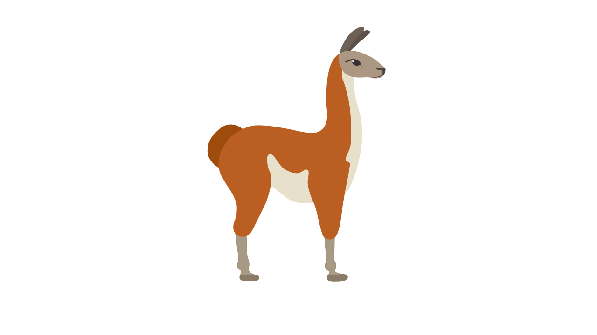

<div align="center">
  
<div>&nbsp;</div>
</div>


[](https://www.python.org/downloads/release/python-390/)
[](https://github.com/psf/black)


<div align="center">

👋🤗🤗👋 Join our [WeChat](assets/wechat.jpg).
</div>

# Efficient Finetuning of Quantized LLMs  --- 低资源的大语言模型量化训练/部署方案


<div align="center">

[中文](README_zh.md) | English
</div>

This is the repo for the `Efficient Finetuning of Quantized LLMs` project, which aims to build and share instruction-following Chinese `baichuan-7b/LLaMA/Pythia/GLM` model tuning methods which can be trained on **a single Nvidia RTX-2080TI**, multi-round chatbot which can be trained on **a single Nvidia RTX-3090** with the context len 2048.

We uses [bitsandbytes](https://github.com/TimDettmers/bitsandbytes) for quantization and is integrated with Huggingface's [PEFT](https://github.com/huggingface/peft) and [transformers](https://github.com/huggingface/transformers/) libraries.


## News

- [23/06/25] We release the supervised finetune baichuan-7B model ( [GaussianTech/baichuan-7b-sft](https://huggingface.co/GaussianTech/baichuan-7b-sft) ) and the corresponding training script.
- [23/06/24] We release the supervised finetune llama-7B model ([GaussianTech/llama-7b-sft](https://huggingface.co/GaussianTech/llama-7b-sft) ) and the corresponding training script.
- [23/06/15] Now we support training the baichuan-7B model in this repo. Try `--model_name_or_path baichuan-inc/baichuan-7B` to use the baichuan-7B model.
- [23/06/03] Now we support quantized training and inference (aka QLoRA). Try `scripts/qlora_finetune/finetune_llama_guanaco7b.sh` and  set `--bits 4/8` argument to work with quantized model.
- [23/05/25] Now we support Lora training and inference. Try  `scripts/lora_finetune/lora-finetune_alpaca.sh` to finetune the LLAMA model with Lora on the Alpaca dataset.
- [23/05/20] Now we support full-parameter tuning and partial-parameter tuning.  Try `scripts/full_finetune/full-finetune_alpaca.sh` to full finetune the LLAMA model on the Alpaca dataset.

## Supported Models

- [LLaMA](https://github.com/facebookresearch/llama) (7B/13B/33B/65B)
- [BLOOM](https://huggingface.co/bigscience/bloom) & [BLOOMZ](https://huggingface.co/bigscience/bloomz) (560M/1.1B/1.7B/3B/7.1B/176B)
- [baichuan](https://huggingface.co/baichuan-inc/baichuan-7B) (7B)
- [OPT](https://huggingface.co/docs/transformers/model_doc/opt) (125M/350M/1.3B/2.7B/6.7B/66B )

## Supported Training Approaches

- (Continually) pre-training
  - Full-parameter tuning
  - Partial-parameter tuning
  - [LoRA](https://arxiv.org/abs/2106.09685)
  - [QLoRA](https://arxiv.org/abs/2305.14314)
- Supervised fine-tuning
  - Full-parameter tuning
  - Partial-parameter tuning
  - [LoRA](https://arxiv.org/abs/2106.09685)
  - [QLoRA](https://arxiv.org/abs/2305.14314)

## Model Zoo

We provide a number of models in the [Hugging Face model hub](https://huggingface.co/decapoda-research). These models are trained with QLoRA and can be used for inference and finetuning. We provide the following models:

| Base Model                                                       | Adapter      | Instruct Datasets                                                                          | Train Script                                              | Log                                                               | Model on Huggingface                                                                |
| ---------------------------------------------------------------- | ------------ | ------------------------------------------------------------------------------------------ | --------------------------------------------------------- | ----------------------------------------------------------------- | ----------------------------------------------------------------------------------- |
| [llama-7b](https://huggingface.co/decapoda-research/llama-7b-hf) | FullFinetune | -                                                                                          | -                                                         | -                                                                 |                                                                                     |
| [llama-7b](https://huggingface.co/decapoda-research/llama-7b-hf) | QLoRA        | [openassistant-guanaco](https://huggingface.co/datasets/timdettmers/openassistant-guanaco) | [finetune_lamma7b](./scripts/finetune_llama_guanaco7b.sh) | [wandb log](https://wandb.ai/jianzhnie/huggingface/runs/1e2km7b1) | [GaussianTech/llama-7b-sft](https://huggingface.co/GaussianTech/llama-7b-sft)       |
| [llama-7b](https://huggingface.co/decapoda-research/llama-7b-hf) | QLoRA        | [OL-CC](https://data.baai.ac.cn/details/OL-CC)                                             | [finetune_lamma7b](./scripts/finetune_llama_guanaco7b.sh) |                                                                   |                                                                                     |
| [baichuan7b](https://huggingface.co/baichuan-inc/baichuan-7B)    | QLoRA        | [openassistant-guanaco](https://huggingface.co/datasets/timdettmers/openassistant-guanaco) | [finetune_baichuan7b](./scripts/finetune_baichuan_7b.sh)  | [wandb log](https://wandb.ai/jianzhnie/huggingface/runs/41lq9joa) | [GaussianTech/baichuan-7b-sft](https://huggingface.co/GaussianTech/baichuan-7b-sft) |
| [baichuan7b](https://huggingface.co/baichuan-inc/baichuan-7B)    | QLoRA        | [OL-CC](https://data.baai.ac.cn/details/OL-CC)                                             | [finetune_baichuan7b](./scripts/finetune_baichuan_7b.sh)  | [wandb log](https://wandb.ai/jianzhnie/huggingface/runs/1lw2bmvn) | -                                                                                   |

## Installation

### Requirement

- CUDA >= 11.0

- Python 3.8+ and PyTorch 1.13.1+
- 🤗Transformers, Datasets, Accelerate, PEFT and bitsandbytes
- jieba, rouge_chinese and nltk (used at evaluation)
- gradio (used in gradio_webserver.py)

### Install required packages

To load models in 4bits with transformers and bitsandbytes, you have to install accelerate and transformers from source and make sure you have the latest version of the bitsandbytes library (0.39.0). You can achieve the above with the following commands:
```bash
pip install -q -U bitsandbytes
pip install -q -U git+https://github.com/huggingface/transformers.git
pip install -q -U git+https://github.com/huggingface/peft.git
pip install -q -U git+https://github.com/huggingface/accelerate.git
```

### Clone the code

Clone this repository and navigate to the Efficient-Tuning-LLMs folder

```bash
git clone https://github.com/jianzhnie/Efficient-Tuning-LLMs.git
cd Efficient-Tuning-LLMs
```

## Getting Started

| mian function      | Useage                                                                               | Scripts                                    |
| ------------------ | ------------------------------------------------------------------------------------ | ------------------------------------------ |
| train.py           | Full finetune LLMs on  SFT datasets                                                  | [full_finetune](./scripts/full_finetune)   |
| train_lora.py      | Finetune LLMs by using Lora  (Low-Rank Adaptation of Large Language Models finetune) | [lora_finetune](./scripts/lora_finetune)   |
| train_qlora.py     | Finetune LLMs by using QLora (QLoRA: Efficient Finetuning of Quantized LLMs)         | [qlora_finetune](./scripts/qlora_finetune) |
| train_multiturn.py | Finetune LLMs on multi turn dialogue datasets                                        | [multiturn](./scripts/multiturn)           |


### QLora int4 Finetune

The `train_qlora.py` code is a starting point for finetuning and inference on various datasets.
Basic command for finetuning a baseline model on the Alpaca dataset:

```bash
python train_qlora.py --model_name_or_path <path_or_name>
```

For models larger than 13B, we recommend adjusting the learning rate:
```bash
python train_qlora.py –learning_rate 0.0001 --model_name_or_path <path_or_name>
```

We can also tweak our hyperparameters:

```bash
python train_qlora.py \
    --model_name_or_path ~/checkpoints/baichuan7b \
    --dataset_name oasst1 \
    --data_dir ~/prompt_datasets \
    --load_from_local \
    --output_dir ./work_dir/oasst1-baichuan-7b \
    --num_train_epochs 4 \
    --per_device_train_batch_size 4 \
    --per_device_eval_batch_size 4 \
    --gradient_accumulation_steps 8 \
    --evaluation_strategy steps \
    --eval_steps 50 \
    --save_strategy steps \
    --save_total_limit 5 \
    --save_steps 100 \
    --logging_strategy steps \
    --logging_steps 1 \
    --learning_rate 0.0002 \
    --warmup_ratio 0.03 \
    --weight_decay 0.0 \
    --lr_scheduler_type constant \
    --adam_beta2 0.999 \
    --max_grad_norm 0.3 \
    --max_new_tokens 32 \
    --source_max_len 512 \
    --target_max_len 512 \
    --lora_r 64 \
    --lora_alpha 16 \
    --lora_dropout 0.1 \
    --double_quant \
    --quant_type nf4 \
    --fp16 \
    --bits 4 \
    --gradient_checkpointing \
    --trust_remote_code \
    --do_train \
    --do_eval \
    --sample_generate \
    --data_seed 42 \
    --seed 0
```

To find more scripts for finetuning and inference, please refer to the `scripts` folder.

## Quantization
Quantization parameters are controlled from the `BitsandbytesConfig` ([see HF documenation](https://huggingface.co/docs/transformers/main_classes/quantization#transformers.BitsAndBytesConfig)) as follows:
- Loading in 4 bits is activated through `load_in_4bit`
- The datatype used for the linear layer computations with `bnb_4bit_compute_dtype`
- Nested quantization is activated through `bnb_4bit_use_double_quant`
- The datatype used for qunatization is specified with `bnb_4bit_quant_type`. Note that there are two supported quantization datatypes `fp4` (four bit float) and `nf4` (normal four bit float). The latter is theoretically optimal for normally distributed weights and we recommend using `nf4`.

```python
    model = AutoModelForCausalLM.from_pretrained(
        model_name_or_path='/name/or/path/to/your/model',
        load_in_4bit=True,
        device_map='auto',
        max_memory=max_memory,
        torch_dtype=torch.bfloat16,
        quantization_config=BitsAndBytesConfig(
            load_in_4bit=True,
            bnb_4bit_compute_dtype=torch.bfloat16,
            bnb_4bit_use_double_quant=True,
            bnb_4bit_quant_type='nf4'
        ),
    )
```

## Tutorials and Demonstrations

We provide two Google Colab notebooks to demonstrate the use of 4bit models in inference and fine-tuning. These notebooks are intended to be a starting point for further research and development.
- [Basic usage Google Colab notebook](https://colab.research.google.com/drive/1ge2F1QSK8Q7h0hn3YKuBCOAS0bK8E0wf?usp=sharing) - This notebook shows how to use 4bit models in inference with all their variants, and how to run GPT-neo-X (a 20B parameter model) on a free Google Colab instance 🤯
- [Fine tuning Google Colab notebook](https://colab.research.google.com/drive/1VoYNfYDKcKRQRor98Zbf2-9VQTtGJ24k?usp=sharing) - This notebook shows how to fine-tune a 4bit model on a downstream task using the Hugging Face ecosystem. We show that it is possible to fine tune GPT-neo-X 20B on a Google Colab instance!

Other examples are found under the examples/ folder.
- Finetune LLama-7B (ex1)
- Finetune GPT-neo-X 20B (ex2)

## Using Local Datasets
You can specify the path to your dataset using the --dataset argument. If the --dataset_format argument is not set, it will default to the Alpaca format. Here are a few examples:

- Training with an alpaca format dataset:
```python
python train_qlora.py --dataset="path/to/your/dataset"
```
- Training with a self-instruct format dataset:

```python
python train_qlora.py --dataset="path/to/your/dataset" --dataset_format="self-instruct"
```

## Multi GPU
Multi GPU training and inference work out-of-the-box with Hugging Face's Accelerate. Note that the per_device_train_batch_size and per_device_eval_batch_size arguments are global batch sizes unlike what their name suggest.

When loading a model for training or inference on multiple GPUs you should pass something like the following to AutoModelForCausalLM.from_pretrained():
```python
device_map = "auto"
max_memory = {i: '46000MB' for i in range(torch.cuda.device_count())}
```

## Inference

### 终端交互式对话

运行下面的脚本，程序会在命令行中和你的ChatBot进行交互式的对话，在命令行中输入指示并回车即可生成回复，输入 `clear` 可以清空对话历史，输入 `stop` 终止程序。

```bash
python cli_demo.py \
    --model_name_or_path ~/checkpoints/baichuan7b \ # base model
    --checkpoint_dir ./work_dir/checkpoint-700  \ # 训练的模型权重
    --trust_remote_code  \
    --double_quant \
    --quant_type nf4 \
    --fp16 \
    --bits 4
```

### 使用 Gradio 进行网页端交互

This file reads the foundation model from the Hugging Face model hub and the LoRA weights from `path/to/your/model_dir`, and runs a Gradio interface for inference on a specified input. Users should treat this as example code for the use of the model, and modify it as needed.

Example usage:

```bash
python gradio_webserver.py \
    --model_name_or_path decapoda-research/llama-7b-hf \
    --lora_model_name_or_path  `path/to/your/model_dir`
```


## Sample Outputs
We provide generations for the models described in the paper for both OA and Vicuna queries in the `eval/generations` folder. These are intended to foster further research on model evaluation and analysis.

Can you distinguish ChatGPT from Guanaco? Give it a try!
You can access [the model response Colab here](https://colab.research.google.com/drive/1kK6xasHiav9nhiRUJjPMZb4fAED4qRHb?usp=sharing) comparing ChatGPT and Guanaco 65B on Vicuna prompts.


## Known Issues and Limitations
Here a list of known issues and bugs. If your issue is not reported here, please open a new issue and describe the problem.

1. 4-bit inference is slow. Currently, our 4-bit inference implementation is not yet integrated with the 4-bit matrix multiplication
2. Resuming a LoRA training run with the Trainer currently runs on an error
3. Currently, using `bnb_4bit_compute_type='fp16'` can lead to instabilities. For 7B LLaMA, only 80% of finetuning runs complete without error. We have solutions, but they are not integrated yet into bitsandbytes.
4. Make sure that `tokenizer.bos_token_id = 1` to avoid generation issues.


## License

`Efficient Finetuning of Quantized LLMs` is released under the Apache 2.0 license.


## Acknowledgements
We thank the Huggingface team, in particular Younes Belkada, for their support integrating QLoRA with PEFT and transformers libraries.

We appreciate the work by many open-source contributors, especially:

- [Alpaca-LoRA](https://github.com/tloen/alpaca-lora/)
- [LoRA](https://github.com/microsoft/LoRA/)
- [Stanford Alpaca](https://github.com/tatsu-lab/stanford_alpaca/)
- [Hugging Face](https://huggingface.co/)
- [LLaMa](https://github.com/facebookresearch/llama/)
- [Vicuna](https://github.com/lm-sys/FastChat/)


## Citation

Please cite the repo if you use the data or code in this repo.

```bibtex
@misc{Chinese-Guanaco,
  author = {jianzhnie},
  title = {Chinese-Guanaco: Efficient Finetuning of Quantized LLMs for Chinese},
  year = {2023},
  publisher = {GitHub},
  journal = {GitHub repository},
  howpublished = {\url{https://github.com/jianzhnie/Efficient-Tuning-LLMs}},
}
```
